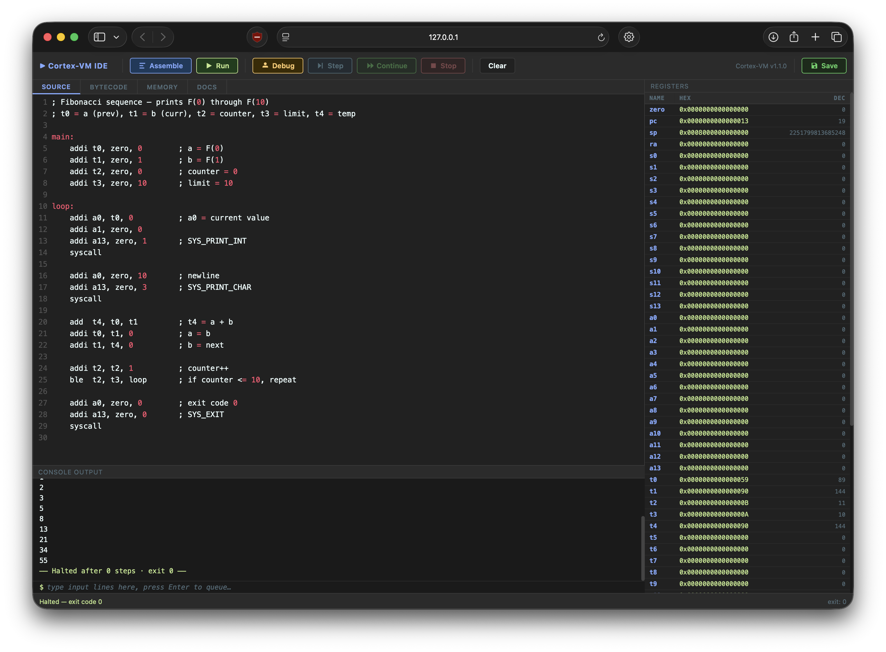

A fast, extensible 64-bit virtual machine and assembler designed as the primary backend target for a custom compiled language.

[](https://github.com/jonahmer22/cortex-vm/actions/workflows/ci.yml)
[](LICENSE)
[](CHANGELOG.md)
[](#)
[](#)

---

## Features

- **64-bit word-addressed architecture** - all registers and memory words are 64-bit; no byte-level addressing complexity
- **Full base ISA** - R, I, S, L, B, and SYS instruction formats; complete ALU, memory, branch, and syscall coverage
- **M extension** - integer multiply and divide (`mul`, `mulh`, `mulhu`, `div`, `divu`, `rem`, `remu`, plus immediate variants)
- **F extension** - full 64-bit IEEE 754 double-precision floating point (`fadd`, `fsub`, `fmul`, `fdiv`, `fsqrt`, `fabs`, `fneg`, `ftoi`, `ftoui`, `itof`, `uitof`, float branches)
- **Built-in assembler** - single-pass with two-pass label resolution; supports labels, `.data` section, hex/binary/octal/char literals, and comments
- **Full disassembler** - converts any binary back to assembly source; reconstructs `.data` strings; round-trips through re-assembly with functional equivalence
- **Rich syscall set** - print/read int/uint/char/float/string, random numbers, file I/O, time, and heap memory allocation
- **Heap memory** - sbrk-style `SYS_HEAP_GROW` syscall allocates words from a realloc-backed contiguous array at `0x0001000000000000`; O(1) access, automatic cleanup after each `run()` call
- **Automatic extension detection** - the assembler inspects opcodes and sets extension flags in the binary header; no manual flags needed
- **Embeddable** - builds as a static library (`libcortex-vm.a`) for use as a runtime inside another project; three-function API: `cortexAssemble`, `cortexExecSource`, `cortexExecBinary`
- **Fast** - ~400M instructions/sec at `-O3 -march=native` on modern hardware (GCC-15)

---

## Quick Start

### Install

```sh
git clone https://github.com/jonahmer22/cortex-vm.git
cd cortex-vm
./install.sh
```

`install.sh` handles everything: initialising submodules, creating a Python virtual environment, installing dependencies, building the binary and library, running the test suite, and installing to `/usr/local`. Requires GCC and Python 3.

> **Developing?** Run `make` directly from the project root instead - see [CONTRIBUTING.md](CONTRIBUTING.md) for details.

### Hello, World

```asm
; hello.s
main:
    addi a0, zero, msg
    addi a13, zero, 5       ; SYS_PRINT_STR
    syscall
    addi a0, zero, 0
    addi a13, zero, 0       ; SYS_EXIT
    syscall

.data
    msg: "Hello, World!\n"
```

```sh
./cortex-vm -a hello.s -o hello.out    # assemble to hello.out
./cortex-vm hello.out                  # run
```

### Assemble and Run in One Step

```sh
./cortex-vm -ar hello.s     # assemble to a.out and run immediately
```

---

## Usage

```
./cortex-vm <binary>                    # run a pre-assembled binary
./cortex-vm -a <source.s>              # assemble to a.out
./cortex-vm -a <source.s> -o <out>     # assemble to a specific path
./cortex-vm -ar <source.s>             # assemble and run immediately
./cortex-vm -ar <source.s> -o <out>    # assemble to a specific path and run
./cortex-vm -d <binary>                # disassemble to out.s
./cortex-vm -d <binary> -o <out.s>     # disassemble to a specific path
./cortex-vm -dr <binary>               # disassemble and run the result
./cortex-vm -V                         # launch the visual IDE in the browser
./cortex-vm -V <source.s>             # launch the IDE with a source file pre-loaded
./cortex-vm -arD <source.s>           # assemble, run, and dump registers as JSON to stderr
```

---

## Visual IDE

`cortex-vm -V` starts a self-contained browser-based IDE on `http://127.0.0.1:<port>` (starting from 7777, scanning upward for the first free port - the exact URL is printed to stdout). No internet connection is required - all assets are embedded in the binary at build time.

```sh
./cortex-vm -V              # open IDE with blank editor
./cortex-vm -V hello.s      # open IDE with hello.s pre-loaded
```



**Features:**

| Panel | Description |
|---|---|
| Editor | CodeMirror editor with GAS syntax highlighting and dark theme |
| Registers | Live 64-register display (hex + decimal) with change highlighting after each run |
| Console | Combined stdin/stdout terminal - type directly into the console for interactive programs |
| Bytecode | Hex view of the assembled binary with entry point and data offset markers |
| Memory | Word-level view of code, stack, and heap regions (debug mode only) |
| Docs | Built-in opcode reference and syscall quick-reference sheet |

**Toolbar actions:**

| Button | Description |
|---|---|
| Assemble | Syntax-check the source without running |
| Run | Assemble and execute; stdout appears in the console |
| Debug | Step through instructions one at a time; set breakpoints in the bytecode view |
| Save | Write changes back to the source file (only available when opened with a file path) |

Press **Ctrl+C** in the terminal to stop the server.

---

## Documentation

| Document                     | Description                                                         |
|------------------------------|---------------------------------------------------------------------|
| [TUTORIAL.md](TUTORIAL.md)   | Step-by-step introduction - from building to writing real programs  |
| [LIBRARY.md](LIBRARY.md)     | How to embed Cortex-VM as a library in another C project            |
| [SPEC.md](SPEC.md)           | Full ISA and implementation reference                               |
| [CHANGELOG.md](CHANGELOG.md) | Version history                                                     |

---

## ISA Overview

### Registers

64 general-purpose 64-bit registers with conventional aliases:

| Alias      | Physical | Role                                                      |
|------------|----------|-----------------------------------------------------------|
| `zero`     | r0       | Hardwired zero                                            |
| `pc`       | r1       | Program counter                                           |
| `sp`       | r2       | Stack pointer                                             |
| `ra`       | r3       | Return address                                            |
| `s0`-`s13` | r4-r17   | Callee-saved                                              |
| `a0`-`a13` | r18-r31  | Caller-saved; args, return values, syscall number (`a13`) |
| `t0`-`t31` | r32-r63  | Temporaries                                               |

### Instruction Formats

| Format       | Opcode                   | Description                                |
|--------------|--------------------------|--------------------------------------------|
| R            | `0x81`                   | Register-to-register ALU                   |
| I            | `0x82`                   | Immediate ALU / jump                       |
| S            | `0x83`                   | Store                                      |
| L            | `0x84`                   | Load                                       |
| B            | `0x85`                   | Branch (PC-relative, 36-bit offset)        |
| SYS          | `0x86`                   | System (`halt`, `syscall`, `nop`, `break`) |
| MR / MI      | `0xE1` / `0xE2`          | M extension: multiply/divide               |
| FR / FI / FB | `0xF1` / `0xF2` / `0xF3` | F extension: float ALU and branches        |

### Example: Loop and Sum

```asm
main:
    addi t0, zero, 0        ; sum = 0
    addi t1, zero, 1        ; i = 1
    addi t2, zero, 11       ; limit = 11
loop:
    add  t0, t0, t1         ; sum += i
    addi t1, t1, 1          ; i++
    blt  t1, t2, loop       ; if i < 11, repeat
    addi a0, t0, 0
    addi a1, zero, 0
    addi a13, zero, 1       ; SYS_PRINT_INT
    syscall
    addi a0, zero, 0
    addi a13, zero, 0       ; SYS_EXIT
    syscall
```

---

## Extensions

Extensions are declared in the binary header and auto-detected by the assembler. The VM refuses to run a binary that requires an unsupported extension.

### M - Integer Multiply/Divide (`EXT_M`, bit 1)

```asm
mul  rd, ra, rb         ; rd = ra * rb (lower 64 bits)
mulh rd, ra, rb         ; rd = ra * rb (upper 64 bits, signed)
div  rd, ra, rb         ; rd = ra / rb (signed)
rem  rd, ra, rb         ; rd = ra % rb (signed)
muli rd, ra, imm        ; rd = ra * imm
```

### F - 64-bit IEEE 754 Floats (`EXT_FLOAT`, bit 0)

```asm
fadd  rd, ra, rb        ; rd = ra + rb
fsqrt rd, ra            ; rd = sqrt(ra)
fblt  ra, rb, label     ; branch if ra < rb (float comparison)
itof  rd, ra            ; rd = (double)(int64_t)ra
ftoi  rd, ra            ; rd = (int64_t)ra  (truncating)
```

Float values live in the same register file - float instructions reinterpret the bits as IEEE 754 doubles.

---

## Syscalls

| Number | Name              | Description                                           |
|--------|-------------------|-------------------------------------------------------|
| 0      | `SYS_EXIT`        | Terminate                                             |
| 1      | `SYS_PRINT_INT`   | Print signed integer (a1: 0=dec, 1=bin, 2=oct, 3=hex) |
| 2      | `SYS_PRINT_UINT`  | Print unsigned integer                                |
| 3      | `SYS_PRINT_CHAR`  | Print character                                       |
| 4      | `SYS_PRINT_FLOAT` | Print float (a1=decimal precision)                    |
| 5      | `SYS_PRINT_STR`   | Print null-terminated string                          |
| 11-15  | `SYS_READ_*`      | Read int/uint/char/float/string from stdin            |
| 21-24  | `SYS_RAND_*`      | Seed, rand int, ranged int, rand float                |
| 31-34  | `SYS_FILE_*`      | Open/read/write/close files                           |
| 41-42  | `SYS_TIME_*`      | Get time (ms), sleep                                  |
| 51-52  | `SYS_HEAP_*`      | Grow heap (alloc N words), query heap top address     |

Full details in [SPEC.md](SPEC.md).

---

## Testing

Install Python dependencies first:

```sh
pip install -r requirements.txt
```

The test suite uses pytest and runs the assembler/VM as a subprocess, verifying stdout for every instruction and syscall.

```sh
pytest
```

261 tests - base ISA, M extension, F extension, syscalls, file I/O, heap memory, library embedding, and 42 disassembler round-trip tests (including `.data` section reconstruction).

## Benchmarking

A Python benchmarking suite lives in `benchmarks/`. It measures throughput across 7 categories and produces a console table, a timestamped JSON file, and matplotlib graphs.

```sh
python benchmarks/run.py                       # full suite (all categories)
python benchmarks/run.py --category alu        # single category
python benchmarks/run.py --no-graphs           # skip PNG generation
python benchmarks/run.py --repeats 10          # more repetitions for stable numbers
```

Categories: integer ALU (MIPS), M extension (MIPS), float ALU (MFLOPS), memory (MIPS), branches (BOPS), real-world programs (ms), assembler throughput (MB/s).

Performance floor assertions can be run via pytest:

```sh
pytest benchmarks/conftest.py -m benchmark
```

---

## Design Goals

Cortex-VM is intentionally simple and compiler-friendly:

- **Word-only addressing** eliminates alignment and byte-ordering edge cases
- **Uniform 64-bit words** make code generation straightforward - no need to track operand widths
- **No implicit side effects** - no condition codes, no hidden state outside the register file
- **Flat calling convention** - up to 13 arguments and 13 return values in registers; no implicit stack frame

---

## License

[GPL v3](LICENSE)

Third-party components bundled with this project are listed in [THIRD_PARTY_LICENSES](THIRD_PARTY_LICENSES).
